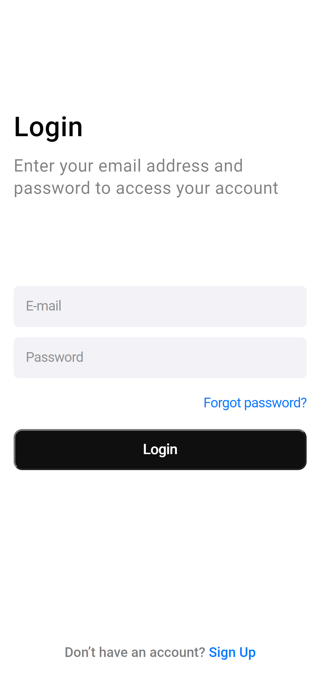

# Login Interface

> Interaface de login feita com com HTML e CSS.

## 🤝 Colaborador

<table>
  <tr>
    <td align="center">
      <a href="https://www.linkedin.com/in/sergiosaraivasilva/">
         
        
          <b>Sérgio Saraiva</b>
        
      </a>
    </td>

</table>
